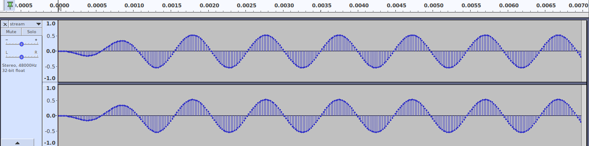

# twinlooper
Python code to interact with Rowin Twin Looper effects pedal

This project started as a discussion on the `loopertrx` project, which supports other pedals.
https://github.com/reinerh/loopertrx

It quickly transpired that my TwinLooper pedal (and others) did not support the same (USB Mass Storage) protocols, instead using Midi SysEx to communicate. From a WireShark log I was able to identify some aspects of this and have started this project.

At this time it should be considered _Experiemental_, there is a high chance that it could do something bad to your pedal (though mine seems OK so far).

# Message format

The messages to and from the pedal appear to have similar format. They are Midi SysEx format, starting `F0` and
ending `F7`. I used the Python module `mido`, which automatically strips these off

```
host    1.3.2   f0:00:32:0d:41:00:00:40:00:00:60:67:7b:20:00:00:00:04:01:f7
```

The other thing about midi is that it is (mostly) 7-bit information, so in-order to communicate 8-bit it needs to 
be packed into 7-bit format.
```
host    1.3.2   f0:00:32:0d:41:00:00:40:00:00:60:67:7b:20:00:00:00:04:01:f7
                ==                                                       == SysEx
                                           [<------ Packed Data ------>]
                                     ^^ ^^ command ??
                            ^^ ^^ ^^ count of bits in packed data (7-bit)
                   ^^ ^^ ^^ Midi device ID

Unpacked Data:
00000000: 00 F0 79 0F 02 00 00 84                           ..y.....
                               ^^ Checksum
                      ^^ ^^ ^^ Byte count requested
          ^^ ^^ ^^ ^^ Address
```

Much is to be discovered, and understood, but I have been able to pull an audio block from the pedal...



Audio can be created on PC with 'play' (from 'sox' package), and recorded on to pedal.
```
$ play -V -r 48000 -n synth sin 1000 vol -10dB
$ play -V -r 48000 -n synth sin 2000 vol -10dB
```
